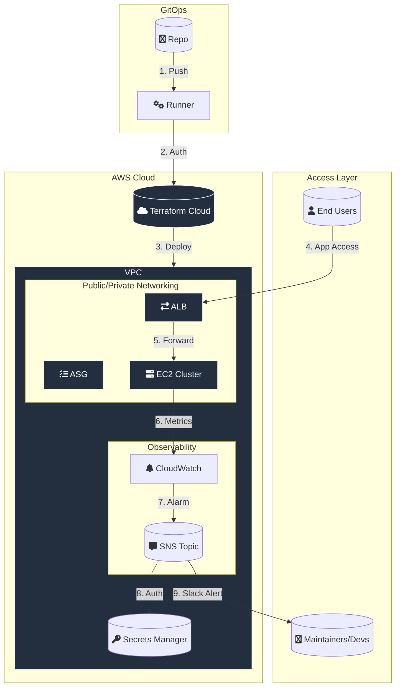

# GitOps-Native AWS Infrastructure

## 🏗️ Architecture Diagram



## 📌 Project Overview
This project is a production-grade, two-tier AWS architecture managed through a **CI/CD pipeline**. It demonstrates a modern developer workflow where infrastructure is treated as code, and all deployments are handled automatically via **GitHub Actions**.

## 🔄 The CI/CD Workflow
1. **Develop:** Infrastructure is defined using Terraform (HCL) on a local machine.
2. **Push:** Code is pushed to the GitHub repository.
3. **Automate:** GitHub Actions triggers a workflow that authenticates to AWS using Secret Access Keys.
4. **Deploy:** Terraform Cloud executes the `plan` and `apply`, provisioning the updated resources in AWS.

## 🚀 Technical Stack
- **IaC:** Terraform & Terraform Cloud
- **CI/CD:** GitHub Actions (Self-hosted/GitHub-hosted runners)
- **Cloud:** AWS (VPC, EC2, ASG, ALB, CloudWatch, Secrets Manager)
- **Security:** Encrypted GitHub Secrets and Terraform Sensitive Variables

## 🏗️ Architecture Overview
- **Networking:** Custom VPC with Public and Private subnets.
- **Compute:** Auto Scaling Group (ASG) ensuring high availability and self-healing.
- **Load Balancing:** Application Load Balancer (ALB) with Security Group Chaining.
- **Observability:** CloudWatch Alarms monitoring health, integrated with **Slack** for real-time notifications.

## 🛠️ Infrastructure Modules
* `/modules/network`: VPC, Subnets, IGW, and NAT Gateways.
* `/modules/iam`: Specialized ECS Task Execution and Task Roles.
* `/modules/alb`: Load Balancer, Listeners, and Target Groups.
* `/modules/webserver`: ASG, Launch Templates, and Instance SGs.
* `/modules/dns`: Route 53 Records.
* `/modules/ssl`: SSL Validation.
* `/modules/monitoring`: SNS Topic, CloudWatch Metric Alarm, SNS Topic Subscription, and CloudWatch Dashboard.

## 🚦 Prerequisites & secrets
Before deploying, ensure you have:
1. An **AWS Account** with IAM credentials.
2. An **HCP Terraform** account and workspace.
3. **GitHub Secrets** configured:
   - `AWS_ACCESS_KEY_ID` / `AWS_SECRET_ACCESS_KEY`
   - `TF_API_TOKEN`
   - `SLACK_WEBHOOK_URL`

## ⚙️ How to Deploy
1. **Clone the Repo:**
   ```bash
   git clone https://github.com/Ohioze2000/gitaction_aws_asg.git

2. Update Variables:
Modify terraform.tfvars or your HCP Terraform workspace variables to match your domain and environment settings.

3. Push to Main:

Bash
git add .
git commit -m "feat: initial deployment"
git push origin main

4. Monitor Slack:
The pipeline will notify your Slack channel once the application is live and provide the ALB DNS URL.

🧹 Cleanup
To tear down the infrastructure and avoid costs:

Go to GitHub Actions -> Infrastructure Cleanup.

Run the workflow manually by cliicking Run workflow.

🧠 Lessons Learned
The Project provided deep insights into the nuances of cloud automation and the realities of managing infrastructure-as-code in a CI/CD environment.

1. Solving the "502 Bad Gateway" Mystery
Perhaps the most significant technical hurdle was resolving a 502 error when accessing the site via a custom domain.
I learned that infrastructure is more than just code; it's a handshake. The issue required auditing the Security Group Chaining and verifying the Route 53 Alias record. I discovered that even if the ALB DNS works, a misconfigured host-header or a stale DNS record can break the entire user experience.

2. Remote State is Non-Negotiable
Transitioning from local state files to HCP Terraform (Terraform Cloud) was a turning point. It taught me the importance of state locking and centralized management in a collaborative environment, preventing "state corruption" that often happens during concurrent runs.